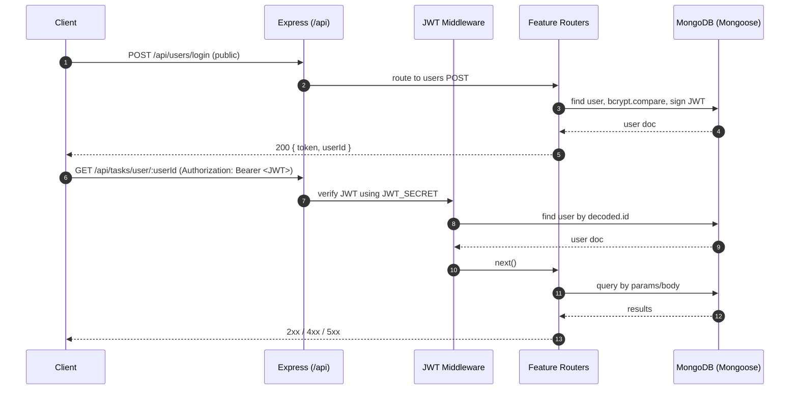

# Procrastinot Backend Architecture (ERD + Flow + Audit)

This document contains:
- Entity-Relationship Diagram (ERD) of the backend data model
- Backend request/auth flow diagram
- Route/auth overview
- Static audit of potential mismatches and security issues with recommended fixes

---

## 1) ERD — MongoDB Models and Relationships

```mermaid
erDiagram
  USER {
    ObjectId _id PK
    string username
    string email
    string password
    string googleId
    ObjectId[] tasks
    ObjectId[] skills
    ObjectId[] skillProgress
    ObjectId[] pomodoroSessions
    ObjectId[] moodLogs
    ObjectId[] completedChallenges
    date createdAt
    date updatedAt
  }

  TASK {
    ObjectId _id PK
    ObjectId userId FK
    string title
    string description
    string status "['Pending','Completed','In Progress','Revise Again']"
    string priority "['Low','Medium','High','Urgent']"
    boolean isImportant
    date dueDate
    string recurrence.type "['none','daily','weekly','monthly','yearly']"
    number recurrence.interval
    date recurrence.endDate
    string category
    string[] tags
    number estimatedTime
    number actualTime
    string moodBefore "['Happy','Neutral','Sad','Stressed']"
    string moodAfter  "['Happy','Neutral','Sad','Stressed']"
    number pomodoroCount
    string[] aiBreakdown
    string attachmentUrl
    ObjectId[] relatedSkills
    ObjectId challenge
    ObjectId[] pomodoroSessions
    date completedAt
    ObjectId parentTask (Task)
    date createdAt
    date updatedAt
  }

  SKILL {
    ObjectId _id PK
    ObjectId userId FK
    string name
    string description
    string category
    string subTopic
    string level "['Beginner','Intermediate','Advanced']"
    string content
    number progress (0-100)
    number streak
    date lastStudiedAt
    string[] aiSuggestions
    date createdAt
    date updatedAt
  }

  SKILL_PROGRESS {
    ObjectId _id PK
    ObjectId userId FK
    ObjectId skillId FK
    string subtopic
    number progress (0-100)
    number streak
    date lastStudiedAt
    date createdAt
    date updatedAt
  }

  POMODORO_SESSION {
    ObjectId _id PK
    ObjectId userId FK
    date startTime
    date endTime
    number duration
    string status "['Completed','In Progress','Paused']"
    ObjectId taskId FK
    string moodBefore "['Happy','Neutral','Sad','Anxious','Excited']"
    string moodAfter  "['Happy','Neutral','Sad','Anxious','Excited']"
    string notes
    date createdAt
    date updatedAt
  }

  MOOD_LOG {
    ObjectId _id PK
    ObjectId userId FK
    string moodType "['Happy','Sad','Anxious','Excited','Tired','Angry','Neutral']"
    string note (<=300)
    string sessionType "['Before Pomodoro','After Pomodoro']"
    date createdAt
    date updatedAt
  }

  CHALLENGE {
    ObjectId _id PK
    string title
    string description
    string difficulty "['Easy','Medium','Hard']"
    string[] tags
    string reward
    date startDate
    date endDate
    number validFor (hours)
    // participants is an embedded array of { user: ObjectId(User), status, startedAt, completedAt }
    ObjectId[] tasks
    date createdAt
    date updatedAt
  }

  USER ||--o{ TASK : "1-to-many"
  USER ||--o{ SKILL : "1-to-many"
  USER ||--o{ SKILL_PROGRESS : "1-to-many"
  USER ||--o{ POMODORO_SESSION : "1-to-many"
  USER ||--o{ MOOD_LOG : "1-to-many"
  TASK }o--o{ SKILL : "many-to-many (relatedSkills)"
  SKILL ||--o{ SKILL_PROGRESS : "1-to-many"
  TASK ||--o{ POMODORO_SESSION : "1-to-many (optional)"
  CHALLENGE ||--o{ TASK : "1-to-many"
  USER }o--o{ CHALLENGE : "many-to-many (participants/completedChallenges)"
```

Notes:
- Many arrays on User (tasks, skills, etc.) duplicate relationships already owned by child documents (e.g., Task.userId). This is workable but requires consistency on create/delete.
- Challenge maintains participants as embedded subdocuments while User also has completedChallenges: keep these in sync.

---

## 2) Backend Request/Auth Flow



---

## 3) Routes and Authentication Overview

Base prefix: /api

Public (no JWT required):
- GET /api/users/google
- GET /api/users/google/callback
- POST /api/users/google-login
- POST /api/users/register
- POST /api/users/login
- POST /api/users/refresh-token

Protected (JWT required via Authorization: Bearer <token>):
- Users: GET /api/users/ (list), GET /api/users/profile/:userId, PUT /api/users/:id, DELETE /api/users/:id
- Tasks: GET /api/tasks/user/:userId, GET /api/tasks/:taskId, POST /api/tasks, PUT /api/tasks/:id, DELETE /api/tasks/:id
- Skills: GET /api/skills, GET /api/skills/user/:userId, GET /api/skills/category/:category, POST /api/skills, PUT /api/skills/:id, DELETE /api/skills/:id
- Skill Progress: GET /api/skill-progress/user/:userId, POST /api/skill-progress, PUT /api/skill-progress/:id, DELETE /api/skill-progress/:id
- Pomodoro: GET /api/pomodoro/user/:userId, POST /api/pomodoro, PUT /api/pomodoro/:id, DELETE /api/pomodoro/:id
- Moods: GET /api/moods/user/:userId, POST /api/moods, PUT /api/moods/:id, DELETE /api/moods/:id
- Challenges: GET /api/challenges, GET /api/challenges/difficulty/:level, POST /api/challenges, PUT /api/challenges/:id, DELETE /api/challenges/:id

Rate Limiting:
- Global: 100 requests / 15 min (all requests)
- Auth endpoints: 5 attempts / 15 min (skips successful requests)

CORS:
- origin: CLIENT_URL (env)
- credentials: true

---

## 4) Static Audit — Readiness, Mismatches, and Security Findings

Status summary:
- Server boot requires env vars: MONGO_URI, JWT_SECRET, PORT, GOOGLE_CLIENT_ID, GOOGLE_CLIENT_SECRET, CLIENT_URL
- JWT auth applied to all non-user-auth endpoints (good)
- Google OAuth wired via passport; token returned to frontend via redirect
- Tests/scripts exist for manual verification

Findings and recommendations:

1) Missing ownership/authorization checks on protected resources (High severity)
- Problem: Most protected routes accept a userId in the URL or operate on arbitrary document IDs but never verify that req.user._id matches the resource owner. Any authenticated user can fetch/update/delete another user’s data if they know the IDs.
- Affected examples:
  - GET /api/tasks/user/:userId
  - GET /api/users/profile/:userId
  - PUT/DELETE on tasks, skills, skill progress, pomodoro, moods by :id
- Recommendation: Enforce ownership at the router layer by adding filters using req.user._id. Examples:
  - When querying by userId, force userId = req.user._id and ignore user-provided userId.
  - When updating/deleting by :id, first find the document and verify its userId equals req.user._id before proceeding.

2) Schema/route field mismatches in SkillProgress (Medium)
- In POST /api/skill-progress, the request accepts lastAccessed and aiSuggestions, but the schema defines lastStudiedAt only and does not have aiSuggestions. With default strict mode, extra fields are dropped silently.
- Fix options:
  - Either change route to use lastStudiedAt and remove aiSuggestions, or
  - Extend SkillProgress schema to include lastAccessed (rename to lastStudiedAt for consistency) and aiSuggestions if desired.

3) Google OAuth callback URL may not match server port (Medium)
- config/passport.js builds callbackURL using SERVER_URL or defaults to http://localhost:8080. If SERVER_URL is not set and PORT != 8080, OAuth callback will be wrong.
- Recommendation: Set SERVER_URL to your actual server public URL (or http://localhost:<PORT> in dev) and configure that in your Google Cloud Console.

4) Username uniqueness collision on Google sign-in (Medium)
- In POST /api/users/google-login, username is sanitized and truncated to 30 characters. If that value is not unique, User.save() will fail due to the unique index.
- Recommendation: On creation, if sanitized username collides, append a short suffix (e.g., -1234) or generate from email prefix plus random segment until unique.

5) Update endpoints missing validation (Low)
- PUT routes for tasks, skills, skillProgress, pomodoro, moods use findByIdAndUpdate without runValidators: true. This bypasses schema validation and allows invalid enums or out-of-range values.
- Recommendation: Use { new: true, runValidators: true } consistently on all findByIdAndUpdate calls.

6) Redundant relationships require consistency (Low)
- User maintains arrays like tasks, skills, etc., while child documents store userId. You currently:
  - Push task ID into User.tasks on task creation (good)
  - Pull from User.tasks on task deletion (good)
- Recommendation: Ensure similar consistency for other entities if you decide to mirror them in the User document (or remove redundancy to reduce maintenance burden).

7) Broad user listing endpoint (Info)
- GET /api/users/ returns all users (without passwords) to any authenticated user. Consider limiting this to admin roles or remove it.

8) Token refresh design (Info)
- POST /api/users/refresh-token allows decoding expired token to re-issue if user matches. This is okay by design, but ensure this matches your security policy.

Environment/config checks:
- Ensure these env vars are set in production:
  - SERVER_URL (for Google OAuth callback)
  - CLIENT_URL (CORS and Google redirect target)
  - MONGO_URI, JWT_SECRET, PORT, GOOGLE_CLIENT_ID, GOOGLE_CLIENT_SECRET

---

## 5) Quick-read Readiness Verdict
- Core architecture and auth middleware are wired correctly; rate-limiting and CORS are set.
- Critical improvements needed before production:
  - Enforce per-user ownership checks on all protected CRUD routes.
  - Fix SkillProgress route/schema mismatch.
  - Set SERVER_URL to avoid Google OAuth callback issues.
  - Add runValidators on updates.

Once the above are addressed, the backend will be aligned and ready.

---

## 6) How to View the Diagrams
- This Markdown uses Mermaid diagrams. Many IDEs and repo platforms render Mermaid directly.
- If needed locally, use a Mermaid viewer/extension or paste the code blocks into https://mermaid.live for a visual rendering.
